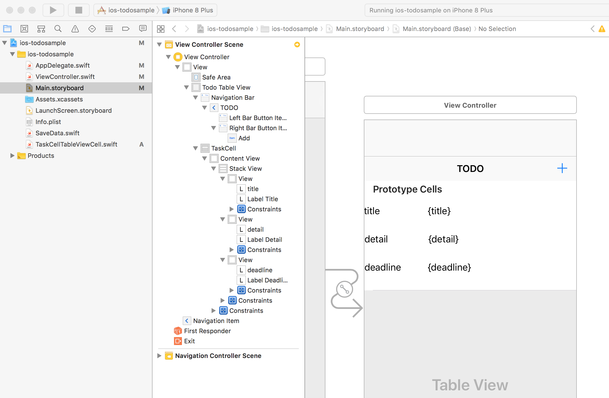

# ios TODO SAMPLE

## 環境

|name|varsion|
|:--:|:--:|
|XCode|9.0.1|
|Swift|4|

## プロジェクトを作成する
XCodeで[File]>[New]>[Project]

SinglePageAppのプロジェクトを作成する

## Navigation Controllerを追加する
Main.storyboardを開いてメニューバーから[Editor]>[Embed In]>[Navigation Controller]をクリックしてNavigationControllerを配置。


## TODO画面を作る

Main.storyboardを開いて初期からあるViewControllerにの中心にTableViewを配置する。
右側のSizeInspectorで[View]>[Arrange]からFill Container HorizontallyとFill ContainerVerticallyを設定してTableViewを全画面に引き伸ばす。

右下のObject LibraryからNavigation BarをViewControllerに配置する。TitleをTODOにする。

右下のObject LibraryからButtonをNavigation Barの右側に配置する。右側のAttribute InspectorからSystem ItemをAddにする。

右下のObject LibraryからTable View CellをTableViewに配置する。
Table View Cellにlabelを配置してStackViewなどで調整する。



### AUTO LAYOUTで比率配置する

比率配置するにはルート要素と比率配置したいものを同時に選択して右下のConstrainsから[Equal Widths]にチェックを入れる。その後ConstrainsのMultiplierプロパティに比率を入れる


配置したTable View Cellを選択して右側のAttribute Inspectorから[Identifier]の項目に[TaskCell]という名前を入力する。この識別子は後でコードから参照するために設定する。


右上のAssistan Editor(横2画面分割のやつ)を開いて右側にView Controller.swiftを表示する。
TableViewをCtrlを押しながらView Controllerにドラッグ・アンド・ドロップしてIBOutletとして紐付ける。
右上の[+]ボタンもCtrlを押しながらView Controllerにドラッグ・アンド・ドロップしてIBActionのfunctionを作成する。


ViewControllerのsuper classとしてUITableViewDelegate、UITableViewDataSourceを指定する。

tableView関数を3つ追加する。

viewDidLoad関数でtodoTableViewのdataSourceとdelegateにselfを指定する。

```swift
import UIKit

class ViewController: UIViewController , UITableViewDelegate, UITableViewDataSource{
    
    // TableViewに表示するデータの個数を返す
    func tableView(_ tableView: UITableView, numberOfRowsInSection section: Int) -> Int {
        
    }
    
    // TableViewのindexPath番目に表示する内容を返す
    func tableView(_ tableView: UITableView, cellForRowAt indexPath: IndexPath) -> UITableViewCell {
        
    }
    
    // TableViewのindexPath番目が選択されたとき
    func tableView(_ tableView: UITableView, didSelectRowAt indexPath: IndexPath) {
        
    }
    

    @IBOutlet weak var todoTableView: UITableView!
    
    @IBAction func onAddTask(_ sender: Any) {
        
    }
    
    override func viewDidLoad() {
        super.viewDidLoad()
        // Do any additional setup after loading the view, typically from a nib.
        
        todoTableView.dataSource = self
        todoTableView.delegate = self
    }

    override func didReceiveMemoryWarning() {
        super.didReceiveMemoryWarning()
        // Dispose of any resources that can be recreated.
    }


}


```

この時点ではtableView関数などからエラーがでてビルドできないが気にしない。

TableViewCellのコードビハインドとしてTaskCellTableViewCell.swiftというファイルを作成する。

Main.storyboardからTaskCellをクリックして右側のIdentify InspectorからCustom Class項目のClass項目に[TaskCellTableViewCell]を指定する。

2画面表示でTable View Cellに配置したtitleとdetailとdeadlineのラベルをctrlを押しながらTaskCellTableViewCellクラスにドラッグ・アンド・ドロップしてIBOutletを3つ紐付ける。

さらにTaskCellTableViewCellクラスにsetCellという関数を追加する。中身はこんな感じ

```swift
func setCell(task:Task){
    self.labelTitle.text = task.title
    self.labelDetail.text = task.detail
    let formatter = DateFormatter()
    formatter.dateFormat = "yyyy-MM-dd'T'HH:mm:ss"
    self.labelDeadline.text = formatter.string(from:
task.deadline)
}
```


## データを管理するクラスを作る
iosアプリケーションでデータを管理するにはlocal databaseのCore DataやRealmなどがあるがcore dataはxcodeのバージョンによって使い方が変わったりめんどくさいのでjsonで保存することにする。

XCodeで[SaveData.swift]というファイルを作る。

中身はこんな感じ

```swift
//
//  SaveData.swift
//  ios-todosample
//
//  Created by garicchi on 2017/10/18.
//  Copyright © 2017年 ryotatogai. All rights reserved.
//

import Foundation

class SaveData{
    static var todo:Todo = Todo()
    static let saveFileName = "data.json"
    
    static func save(){
        let json = try? JSONEncoder().encode(todo)
        let dirUrl = FileManager.default.urls(for: .documentDirectory, in: .userDomainMask).last
        let saveUrl = URL(string: saveFileName, relativeTo: dirUrl)!
        try? json?.write(to: saveUrl)
    }
    
    static func load(){
        let dirUrl = FileManager.default.urls(for: .documentDirectory, in: .userDomainMask).last
        let saveUrl = URL(string: saveFileName, relativeTo: dirUrl)!
        do{
            let _todo = try JSONDecoder().decode(Todo.self, from: Data(contentsOf: saveUrl))
            self.todo = _todo
        }catch{
            self.todo = Todo()
            let task1 = Task(id: UUID().uuidString, title: "テストタスク1", detail: "テスト1", deadline: Date())
            let task2 = Task(id: UUID().uuidString, title: "テストタスク2", detail: "テスト2", deadline: Date())
            self.todo.tasks.append(task1)
            self.todo.tasks.append(task2)
        }
    }
    
    static func add(task:Task){
        todo.tasks.append(task)
    }
    
    static func remove(task:Task){
        var counter:Int = 0
        for e in todo.tasks {
            if task.id == e.id {
                break
            }
            counter += 1
        }
        todo.tasks.remove(at: counter)
    }
    
    static func get(id:String) -> Task{
        var counter:Int = 0
        for e in todo.tasks {
            if id == e.id {
                break
            }
            counter += 1
        }
        return todo.tasks[counter]
    }
    
    static func update(task:Task){
        var counter:Int = 0
        for e in todo.tasks {
            if task.id == e.id {
                break
            }
            counter += 1
        }
        todo.tasks[counter] = task
    }
    
    static func at(index:Int) -> Task{
        return todo.tasks[index]
    }
    
    static func size() -> Int{
        return todo.tasks.count
    }
}

// TODOデータの定義
// Codableを継承することでjsonへとマップできる
struct Todo:Codable{
    var tasks:Array<Task> = []
}

struct Task:Codable{
    var id:String
    var title:String
    var detail:String
    var deadline:Date
}


```

## TODO画面にデータを表示する


ViewController.swiftを開く。

すでに作成していたtableView関数の中身を以下のようにする
didSelectRowAtを引数にとるtableView関数は空で良い。

```swift
// TableViewに表示するデータの個数を返す
func tableView(_ tableView: UITableView, numberOfRowsInSection section: Int) -> Int {
    return SaveData.size()
}
// TableViewのindexPath番目に表示する内容を返す
func tableView(_ tableView: UITableView, cellForRowAt indexPath: IndexPath) -> UITableViewCell {
    let cell = todoTableView.dequeueReusableCell(withIdentifier: "TaskCell", for: indexPath) as!
TaskCellTableViewCell
    let task = SaveData.at(index: indexPath.item)
    cell.setCell(task: task)
    return cell
}
```

この時点でTodoを表示できるようになっているはず


## TODO新規作成画面を作る

Main.storyboardを開いて右下のObjectLibraryからView Controllerを画面にドラッグ・アンド・ドロップして新規画面を作る

先程のTodoを表示しているView Controllerの上にある黄色いマークからCtrlを押しながらドラッグアンドドロップして新規作成したView ControllerへSegueをつなげる。

Segue(ViewController間を紐付けている線)を選択して右上からStoryboard SegueのIdentifierに[segueNewTask]という名前を設定する。


新しくNewTaskViewController.swiftというクラスを作成してUIViewControllerを継承させる。
Storyboardで新しく作成したView ControllerのCustom ClassをNewTaskViewControllerにする。

新規作成画面を設計する。必要なlabelとtextField、DatePickerを追加する。上にはNavbarItem、右上にはSaveボタンを付ける。
2つのtextFieldと1つのDatePickerはIBOutletとしてNewTaskViewController.swiftに紐付ける。またSaveボタンのIBActionも紐付ける。


ViewControllerに紐付いている[+]ボタンのIBActionのfuncは以下のようにする

```swift
@IBAction func onAddTask(_ sender: Any) {
    performSegue(withIdentifier: "segueNewTask", sender: sender)
}
```

NewTaskViewControllerのsaveボタンを押したときのIBAction関数を以下のようにする。

```swift
@IBAction func onSave(_ sender: Any) {
    let id = UUID().uuidString
    let title = textTitle.text!
    let detail = textDetail.text!
    let deadline = dateDeadline.date
    let task = Task(id: id, title: title, detail: detail, deadline: deadline)
    SaveData.load()
    SaveData.add(task: task)
    SaveData.save()
    navigationController?.popViewController(animated: true)
}
```

アプリを実行してタスクを追加できることを確認する

## TASK UPDATE画面を作る
Update画面についてもNew Task画面と同様に作る。注意点としてはdidSelectedRowAtを引数にとるtableView関数内でperformSegueを呼んでTaskUpdate画面に遷移する。
値を渡す場合はprepareで渡す。

```swift
// TableViewのindexPath番目が選択されたとき
func tableView(_ tableView: UITableView, didSelectRowAt indexPath: IndexPath) {
    let task = SaveData.at(index: indexPath.item)
    selectedId = task.id
    performSegue(withIdentifier: "segueUpdateTask", sender: self)
}
// segueで画面遷移する時に呼ばれる。遷移先の画面に値を渡す
override func prepare(for segue: UIStoryboardSegue, sender: Any?) {
    if(segue.identifier == "segueUpdateTask"){
        let vc = segue.destination as! UpdateTaskViewController
        let task = SaveData.get(id: selectedId!)
        vc.setTask(task:task)
    }
    
}
```

## 削除機能を実装する
TableViewの削除操作を検知するにはeditingStyleを引数に取るtableView関数に処理を書く。

```swift
// TableViewをスワイプした時に呼ばれる
func tableView(_ tableView: UITableView, commit editingStyle: UITableViewCellEditingStyle, forRowAt
indexPath: IndexPath) {
    if editingStyle == .delete {
        let task = SaveData.at(index: indexPath.item)
        SaveData.remove(task: task)
        tableView.reloadData()
    }
}
```

これでTableViewをスワイプすれば削除できる。
